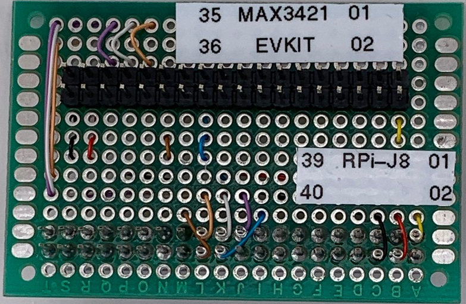

# max3421-usb-host-example-rpi-6.1.y

Maxim / Analog Devices MAX3421e USB host example (hcd device driver integration test) on Raspberry Pi (kernel 6.1.y)

The max3421-hcd firmware driver is part of the standard linux kernel source code, and has been for several years.
The source code is located here:

https://github.com/torvalds/linux
  - drivers/usb/host/max3421-hcd.c
  - include/linux/platform_data/max3421-hcd.h
  - Documentation/devicetree/bindings/usb/maxim,max3421.txt

What I did here was just a small integration project to enable building that module and connecting it to some specific hardware interface pins, as a test/demo.
Different hardware platforms will require adjustments to the device tree, specifying which spi bus connects to the max3421 device itself.

I built the kernel 6.1 (sublevel 31) self-hosted on the Raspberry Pi 3, with one change to the default configuration file, 
`CONFIG_USB_MAX3421_HCD=m`, to make the system enable the MAX3421 device driver module (normally omitted from the standard build).
This option can be enabled using the `make menuconfig` configuration GUI, then select `Device Drivers` | `USB Support` | `MAX3421 HCD (USB-over-SPI) support` and set it to `<M>`

Additionally, I added a Device Tree Overlay `spi0-max3421e` to connect the max3421-hcd device driver to the hardware pins.

After building and installing the updated kernel, I updated the boot config.txt to use the overlay: `dtoverlay=spi0-max3421e`

Some useful commands:

`CTRL+ALT+T` brings up a shell window (command-line interface).

````
    lsusb -v --tree
````
lists the attached USB devices, verbose, printed as a tree

````
    dmesg
````
prints the list of kernel messages

````
    dmesg -H --follow
````
continuously prints kernel messages, including new messages

Plugging in a USB flash drive will automatically mount into the file system.

# Hardware

The MAX3421E Evaluation Board was adapted using a small, hand-wired transition board.
The MAX3421E Evaluation Board was modified by isolating U3 MAX4793 pin 3 (ON input), and adding a wire from U3 pin 1 (+5V IN) to U3 pin 3 (ON), so that the USB-A host connector provides +5V power output.
The Raspberry Pi 3A+ 40-pin connector provides +3.3V and +5.0V power supplies to the board, as well as SPI communications and interrupt handling.

```
# Interface Hardware         Top View, board edge here-->|                  
#                                    RASPBERRY Pi3 A+/B+ |                  
#       to MAX3421EVKIT                     +--PI3-J8--+ |                  
# A        +----J4----+                3.3V |[01]  [02]| |A 5.0V            
# B   3.3V |[01]  [02]| 3.3V        sda g2  | 03   [04]| |B 5.0V            
# C        | 03    04 |             scl g3  | 05   [06]| |C GND             
# D        | 05    06 | p.sck           g4  | 07    08 | |D g14 txd         
# E        | 07    08 | p.miso          GND |[09]   10 | |E g15 rxd         
# F        | 09    10 | p.mosi          g17 | 11    12 | |F g18             
# G H.GPX  | 11    12 | p.ssn           g27 | 13   [14]| |G GND             
# H        | 13    14 |                 g22 | 15    16 | |H g23             
# I        | 15    16 | p.resn         3.3V |[17]   18 | |I g24             
# J        | 17    18 | H.RESN   H.MOSI G10 |[19]  [20]| |J GND             
# K        | 19    20 |          H.MISO G9  |[21]  [22]| |K G25 INT H.INT   
# L        | 21   [22]| H.INT    H.SCK  G11 |[23]  [24]| |L G8  CE0         
# M        | 23    24 |                 GND |[25]  [26]| |M g7  CE1 H.SSN   
# N  p.int | 25   [26]| H.SSN         id.sd | 27    28 | |N id.sc           
# O H.SCK  |[27]   28 |                 g5  | 29   [30]| |O GND             
# P H.MISO |[29]   30 | p.gpx           g6  | 31    32 | |P g12             
# Q H.MOSI |[31]   32 |                 g13 | 33   [34]| |Q GND             
# R   5.0V |[33]  [34]| 5.0V            g19 | 35    36 | |R g16             
# S    GND |[35]  [36]| GND             g26 | 37    38 | |S g20             
# T        +----J4----+                 GND |[39]   40 | |T g21             
#                                           +--PI3-J8--+ |                  
#
#   Note: MAX3421EVKIT reset signal H.RESN must be driven by 3.3V
#   Note: MAX3421EVKIT chip select signal H.SSN is driven by spi0.1 = CE1 = GPIO G7
#
```

# Hardware - Photos





## Hardware - Patch MAX3421EVKIT U3 to enable driving +5V bus as USB Host


The MAX3421EVKIT board requires a modification to enable driving +5V bus as USB Host.

    1. Cut the trace from pin 3 of U3 to the via hole.
    2. Solder a wire from pin 1 to pin 3 of U3.


# Building the project

On a Raspberry Pi 3A+, check out a local copy of this repository anonymously:

~~~
git clone https://github.com/whismanoid/max3421-usb-host-example-rpi-6.1.y.git ~/max3421-usb-host-example-rpi-6.1.y
~~~

(Note: pressing CTRL+ALT+T brings up a terminal window where these command lines can be run using copy/paste.)

Now install the required development tools and download the source code of the Raspberry Pi OS (which is based on linux) using these two scripts:

~~~
. ~/max3421-usb-host-example-rpi-6.1.y/step1_install_tools.sh
. ~/max3421-usb-host-example-rpi-6.1.y/step2_clone_sources.sh
~~~

This script leaves a fresh copy of the OS kernel source code in your ~/linux-test/linux directory. Now configure the kernel to support MAX3421. The build operation may take several hours.

~~~
. ~/max3421-usb-host-example-rpi-6.1.y/step3_configure.sh
. ~/max3421-usb-host-example-rpi-6.1.y/step4_build.sh
reboot
~~~

After finishing, the system shall reboot and will then be running the newly built kernel.


# Testing the project

With the power off, connect the MAX3421 hardware, and then power up the system and run the test script:

~~~
. ~/max3421-usb-host-example-rpi-6.1.y/step5_test.sh
~~~~


# TODO items

  - Investigate isolated 12M USB host using one of the SPI digital isolator products.
    - Isolation devices add propagation delay, requiring reduced SPI SCLK rates
    - Configure device tree overlay for MAX3421E at slow SPI SCLK rate (8MHz)
    - How much does the reduced SCLK rate affect USB host performance? How slow can we go?
    - Slower SCLK rate will support wider range of isolation options
    - Analog Devices ADUM3150 digital isolator (3.75kV isolation rating)
    - Analog Devices ADUM4150 digital isolator (5kV isolation rating)
    - Does this solution make any sense vs USB Isolators? e.g. ADUM3165, LTM2894, ADUM3160?
  - `git clone git@github.com:whismanoid/max3421-usb-host-example-rpi-6.1.y.git ~/max3421-usb-host-example-rpi-6.1.y` only works if you're me

